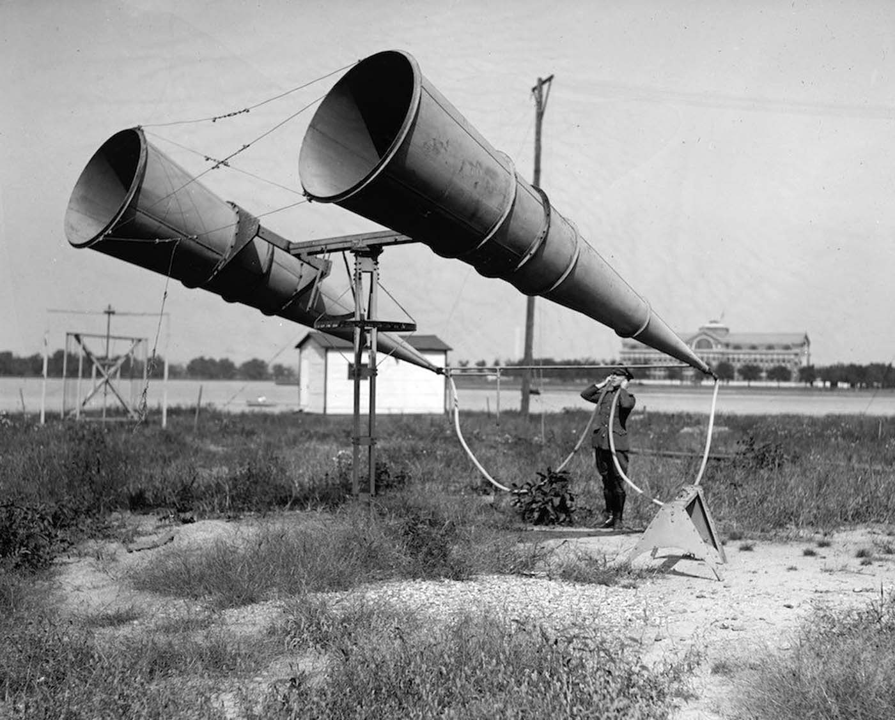

This repository introduces the concept of self-documenting cryptography, which is the art of using self-reference and self-narration in cryptographic constructions in order to communicate certain indelible facts to legitimate users and other observers.

Most notably, the Global Password Prehash Protocol (G3P) proposes affixing a metaphorical property tag to password hash functions, so that being able to compute the correct password hash function implies knowledge of the tag. If you can crack a self-documenting password hash, you have to know where to report it stolen. If you don't know where to report it as stolen, then you shouldn't be able to crack it.

This in turn implicates the topic of cryptoacoustics, which is the art of transmitting [signals](https://en.wikipedia.org/wiki/Signal) in the [medium](https://en.wikipedia.org/wiki/Transmission_medium) of cryptographic state changes in ways that are easily decoded and understood by observers, and that maximize the _minimum obfuscation overhead_. This is overhead imposed by the most efficient tag obfuscation attack that would be secure against a good reverse engineer.

Cryptography more typically depends on the property that if you know a key, then you can compute a cryptographic function. Cryptoacoustics depends upon the converse: if you can compute some cryptographic function, then you know (part of) its key. When this proposition holds, that part of the key can be used to convey a message.

Conveying a message requires the use of a transmission medium. In our scenario, cryptographic state changes serve as a virtual transmission medium. This medium is purely mathematical and has no physical basis. It arises in the context of past communications that occurred via physical transmission media. In the case of the G3P, this context is that somebody hashed a password, and then somebody else stole that hash.

Since most (all?) common cryptographic hash functions exclusive-or their input into a state machine, suffixing a plaintext tag to the end of observer-supplied input plausibly exhibits desirable cryptoacoustic properties for most any cryptographic hash function.

This tagging process is not unlike a digital watermark, however, the G3P provides no means of authenticating whether or not any purported password hash is genuine or not, so there's plausible deniability baked into this watermarking process.

Rather, the tag is only readable during the password hashing process. Thus, this watermark represents a belief about where a password hash came from, a belief that must be correct to achieve offline attacks on truly genuine hashes.

This is not an interactive communication protocol, yet non-interactive communication protocols can be extremely useful. Consider for example broadcast television, broadcast radio, [WSPR](https://en.wikipedia.org/wiki/WSPR_\(amateur_radio_software\)) and other radio beacon protocols, or a physical property tag.

This project follows various philosophies of documentation-driven design. It is also an example of design for reverse engineering.

## Global Password Prehash Protocol (G3P)

The [G3P](g3p-hash/lib/Crypto/G3P.hs) is a self-documenting password hash function based on PHKDF wrapped around [bcrypt](https://www.usenix.org/publications/loginonline/bcrypt-25-retrospective-password-security). It is [designed](design-documents/g3p.md) to be particularly suitable for use on the user's endpoint before a password is sent to an authentication server.

The G3P is self-documenting in the sense that password hashes are supposed to be _traceable_ or _useless_ after they have been _stolen_. If Acme Corporation were to deploy the G3P, and their password hash database was stolen, then it is supposed to be impossible for the thief to outsource any brute force attacks on Acme's password database without announcing that the password hashes are Acme's.

The purpose is to point their conspirator in the correct direction to sell out the endeavor to Acme and report the hashes as stolen. In doing so, I hope to make it increasingly untenable to post meaningful password hashes where they can be widely seen without drawing the attention of relevant security departments.

Similarly, if a botnet is used to try to crack Acme's password hashes using stolen computing resources, then the G3P is designed to make it easy for a security analyst who observes this payload on the botnet to report the payload(s) and other observations back to Acme's security tip line.

These are two concrete examples of the way cryptoacoustics abstracts over the exact physical communication that created a given context. Cryptoacoustics summarizes some of the valid inferences that parties must be able to draw as a result of past communications.

In effect, this is an attempt to move towards a closer approximation of [closed-loop](https://en.wikipedia.org/wiki/Closed-loop_controller) detection of leaked password hashes. In the longer run, I hope that will disrupt the activities of the cybercriminal scene. That said, I expect the more profound change in behavior will ultimately be the promotion of more antifragile attitudes and practices among security departments.

The major design goals for the G3P were:

1. All HMAC calls and the overwhelming majority of SHA256 blocks should be covered by at least one self-documenting constant.

2. Follow the guidance of [RFC 5869](https://datatracker.ietf.org/doc/html/rfc5869) and [NIST Special Publication 800-108r1](https://csrc.nist.gov/publications/detail/sp/800-108/rev-1/final) as closely as possible

3. Offer the strongest API guarantees that are reasonably possible, without introducing extravagant complexity to do so.  Any implementation complexity must result in meaningful payoffs.

## Seguid Protocol

The [Seguid Protocol](design-documents/seguid.md) is a domain-specific hash function that produces Self-Documenting Globally Unique Identifiers, or _seguids_. Seguids are self-documenting in the sense that they cryptographically attest to their own provenance and their own official documentation for y'all to follow.

The Seguid Protocol turns HMAC keys (e.g. HKDF salts) into self-documenting tags.  The ability to compute an HMAC function does not imply direct knowledge of the HMAC key, and so therefore the key does not have any plaintext cryptoacoustic properties.  However, the ability to compute an HMAC function does imply knowledge of a cryptographic hash of the HMAC key, so HMAC keys do have indirect cryptoacoustic properties.

Seguids improve coverage of the G3P by self-documenting tags, thus advancing its first design goal. It also plausibly advances the G3P's second design goal as well, as the seguid protocol is intended to produce outputs that qualify as a _key derivation key_ (KDK) in NIST parlance.

The Seguid Protocol aspires to be a meta-KDK that can produce the highest quality KDKs on demand, thus providing answers for "what salt should I use for HKDF?" among other questions.

One of the practical advantages of using a strongly-randomized seguid as part of the salt for a deployment of the G3P is that any precomputation of a password hash dictionary is out of the question until after the seguid is created.

## PHKDF

PHKDF is a unification and synthesis of PBKDF2, HKDF, and TupleHash.  The name was chosen because the construction itself is a portmanteau of the PBKDF2 algorithm and the HKDF algorithm.

For example, it's not a great idea to use literal PBKDF2 to generate more than one output block worth of data. It would make much more sense to take HKDF apart into it's constituent HKDF-Extract and HKDF-Expand, and then replace the HMAC that is used as the extraction function with a call to PBKDF2, and feed exactly one output block from PBKDF2 as the pseudorandom key to HKDF-Expand.

This is more or less what PHKDF suggests as a complete application of the construction. Except the low-level [`phkdfStream`](phkdf/lib/Crypto/PHKDF/Primitives.hs) primitive is essentially a mildly dangerous modification of the HKDF-Expand algorithm that allows a PBKDF2-like construction to be implemented as two calls to `phkdfStream`. PHKDF suggests that the output of this not-literally-PBKDF2 construction is then used to derive a secret key for a third call to `phkdfStream` that serves the role of `HKDF-Expand` in the high-level overview given above.

This lower-level `phkdfStream` primitive intentionally violates the letter of HKDF's design philosophy of maintaining a clean separation between extraction and expansion. However this is in service to allowing a single primitive to serve in both roles, allowing cryptoacoustic tags to be consistently applied to every call to HMAC in a larger key derivation protocol.

Taking a higher-level view, PHKDF affirms the spirit of the HKDF's design principle. It is highly recommended that any complete applications of `phkdfStream` themselves express a clear distinction between extraction and expansion, even if the low level building block does not.

The documentation for [`Crypto.PHKDF.Primitives`](phkdf/lib/Crypto/PHKDF/Primitives.hs) module demonstrates `hkdfSimple` as a fully worked example without key-stretching, and `mySimplePhkdf` as a worked example with key-stretching. Further examples are provided as [`phkdfSimple`](phkdf/lib/Crypto/PHKDF.hs) and [`phkdfPass`](phkdf/lib/Crypto/PHKDF.hs). These are essentially slightly simplified design studies for the G3P, though they could conceivably be of interest for deployment.

## Why Adopt Cryptoacoustics?

From a certain point of view that is particularly cautious, the G3P's application of cryptoacoustics is nothing more than a novel justification for the `FixedInfo` parameters mentioned in [NIST SP 800-56C](https://csrc.nist.gov/pubs/sp/800/56/c/r2/final), or alternatively the `Label` and `Context` parameters mentioned in [NIST SP 800-108](https://csrc.nist.gov/pubs/sp/800/108/r1/final).

Furthermore, the G3P applies these insights to the topic of password hashing in a possibly novel way to make specific suggestions about what kind of data to include in these contextual parameters. So from this point of view, the changes adopted by the G3P are particularly cautious and low-risk.

I know of no theoretical basis for believing the cryptoacoustic constructions deployed by the G3P are workably secure in the way I conjecture they are. Clearly this situation is not ideal, and should not be tolerated in the long run.

However, in the short run, I'm unconcerned about this state of affairs. Successfully attacking the G3P's cryptoacoustic properties requires a non-trivial response by somebody who cares enough. This scenario would be a secondary cybersecurity concern anyway, as this very concern has been largely or entirely neglected until now.

Thus it seems smart to deploy some of the oldest password hash functions that have continued to be viable for new, well-informed, high-security deployments, in a way that provides incentives to more deeply understand our existing tools in a new way.

Whether or not the particular cryptoacoustic constructions employed by the G3P stand up to scrutiny in the long term, deeper study of these issues might someday pave the way for new cryptographic hash functions that have enhanced cryptoacoustic potential by maximizing the _minimum obscuration overhead_ for contextual parameters.

## Why call it "Cryptoacoustics"?

Some might take umbrage at the fanciful name I've chosen for this technique, but I'm pretty sure it's an important enough technique to deserve a memorable name, and I suspect that reactive resistance to the name tends to be more a symptom of the relatively small intersection between people with a less-than-naive background in cryptography and people with a similar background in signals and systems.

The analogy between cryptography and signals is not completely clarified in my mind. However, I am confident that this analogy is reasonably deep and fertile, at least if you assume that some cryptographic construction exhibits high enough _minimum obfuscation overhead_ for the topic of cryptoacoustics to be viable in the long term. On that count, I am cautiously optimistic, but we need a theory of cryptoacoustics before answering that question is really possible.

There's no technical reason to go with acoustics as the name for the metaphor versus say, something that suggests a different physical transmission medium such as radio waves, visible light, electronic circuitry, or perhaps just a generic "cryptosignaling". However I don't feel cryptosignaling is nearly as memorable or descriptive, and sound is the primary means of communication for most humans in face-to-face physical interactions.

I also went with cryptoacoustics because I am interested in hi-fi audio and professional sound reinforcement systems, and was thinking a fair bit about those topics while I was developing cryptoacoustics.

I am sure I would have found cryptoacoustics to be a rather surprising concept as recently as July 2022. That reminded me of the pleasantly surprising acoustics of [Chicago's Field Museum of Natural History](https://www.fieldmuseum.org/), which I remember my [swing choir](https://en.wikipedia.org/wiki/Glee_\(TV_series\)) exploring on a performance-adjacent field trip. While that kind of effect is better experienced in person, Malinda provides a reasonable YouTube demonstration of the kinds of acoustic effects that are possible in [Singing in Church](https://www.youtube.com/watch?v=H6zswBOzxig).

I was also amused to first read Niels Provos' retrospective on [Bcrypt at 25](https://www.usenix.org/publications/loginonline/bcrypt-25-retrospective-password-security) sometime in late August or early September of 2023, in a context where I had already compared the cryptoacoustics of bcrypt in the G3P to a subwoofer. I found out that Niels has a cybersecurity-themed EDM (Electronic Dance Music) project under his moniker [activ8te](https://activ8te.bandcamp.com/). EDM music is certainly known for it's relatively heavy use of synth bass, which makes those subs woof.

## Cryptoacoustics as Watermarking

Cryptoacoustics is an alternative form of _digital watermarking_. However, I don't expect the existing literature in this subfield to be of much direct benefit to developing a proper theoretical basis for cryptoacoustics, as there seems to always be differences in assumptions that often seem irreconcilable.

For example, wikipedia describes [digital watermarking](https://en.wikipedia.org/wiki/Digital_watermarking) as "a kind of marker covertly embedded in a noise-tolerant signal such as audio, video or image data." By contrast, cryptoacoustics attempts to _overtly_ embed a tag into a noise-_intolerant_ signal, namely the inputs to a cryptographic function.  This intolerance for noise hopefully serves as a bulwark against obfuscation.

The literature usually requires that a watermarked signal be nearly identical to the original signal. By contrast, a tagged hash should look nothing like an untagged hash, in that these two should be statistically independent and indistinguishable without access to the underlying cryptographic secrets, a property which provides the built-in plausible deniability of any given tag. For this reason, cryptoacoustics should prove to be much more robust than more traditional forms of digital watermarking, as it's starting from much stronger assumptions.

## Cryptoacoustics and Obfuscation

The existing literature on [program obfuscation](https://blog.cryptographyengineering.com/2014/02/21/cryptographic-obfuscation-and/) is much more likely to be relevant to building a proper theoretical foundation for cryptoacoustics. Most famous is the paper "[On the (Im)possibility of Obfuscating Programs](https://www.iacr.org/archive/crypto2001/21390001.pdf)" by Barak et al.

While a cursory reading of this paper might suggest that it supports the plausibility of cryptoacoustics, I'm unconvinced that a more careful reading of this paper either supports or detracts in any significant way.

In particular, the unobfuscatable property demonstrated in the aforementioned paper is not directly useful for creating a general-purpose plaintext tagging construction. Furthermore, it seems far from obvious that this particular construction (or something like it) can be used for any practical purpose.

At the time the paper was written, whether or not full homomorphic encryption was even possible was still an open question. Surprisingly, FHE does exist, which seems to rule out many or most practical use cases for a truly unobfuscatable program property in the sense of Barak et al.

### Obfuscation Overhead

Cracking a password hash is a rather costly endeavor that is particularly sensitive to inefficiency. For this reason, cryptoacoustics need not rely a notion of "unobfuscatable" that is as stringent as found in Barak et al.

What is crucial is the _minimum obfuscation overhead_, that is, the overhead represented by the most efficient tag obscuration attack available on a tagging construction. My guess is that this minimum obfuscation overhead must be at least two orders of magnitude to sort of be minimally viable in the case of slow password hashing.

Of course, if one is uploading a password hash to a botnet to be cracked, there are simple techniques that will keep the tag out of a dump of the string constants inside the blob of executable code. However, these simple techniques are all vulnerable to a competent reverse engineer.  Thus in order for an tag obscuration attack to be relevant to this section, it must be secure against a good reverse engineer. This suggests that some form of homomorphic encryption would be a required component of such an attack.

If such a hypothetical tag obscuration attack imposes a 100x overhead on the overall password cracking process, it will probably never be used in practice. A weak-ish password that costs $100 to crack would then cost $10,000 to crack. That provides an $9900 incentive to either reveal the target to the cracker or bring the attack in-house.

Even in the case of cracking attacks carried out using a botnet or other stolen computing resources, cutting the guessing rate by two orders of magnitude still represents a significant opportunity cost.

At 10x overhead, you might start to see a few oddball cases where people are willing to employ tag obfuscation techniques, but I would expect such an approach to remain rather niche. In this scenario, I believe that a cryptoacoustic construction would likely remain reasonably effective at spreading a message, even if that particular construction would not appear to be cryptoacoustically viable going forward.

At a 4x cost multiplier, you might actually start to see the adoption of tag obfuscation technology by password crackers. If that cost multiplier approaches 1x, then tag obscuration becomes essentially free, and I would expect the attack to be widely adopted by nefarious password crackers. This would represent a total failure of the primary objective. However, such a failure would not represent a total failure for the overall effort. Such an attack would almost certainly provide real insight into the research program for cryptoacoustics.

A slow password hash function is probably a best-case scenario for cryptoacoustics. With sufficient key stretching, 100x overhead is likely more than enough to dissuade most anybody from deploying a practical attack. Without key stretching, say a single application of HMAC or HKDF, deploying an attack with an 1000x or greater overhead might not be out of the question in other applications.

For example, the Seguid Protocol is HKDF that specifies constant salt and info parameters. Correspondingly, the Seguid Protocol uses these parameters as cryptoacoustic tags, narrating itself in an attempt to help out any reverse engineer who is examining code that implements the Seguid Protocol contextualize what they are looking at.

Since the Seguid Protocol applies no key stretching, millions of hashes can be computed per second. Thus the most efficient tag obscuration attack may need to impose 100,000x overhead or more in order to be truly effective in this scenario. For this reason, slow password hashing seems to be a best-case scenario for the application of cryptoacoustics.

Though it's presumably much easier in practice to deploy tag obscuration attacks against the Seguid Protocol compared to the G3P, it's also far less clear what practical benefits this might confer to an attacker. At my own current level of understanding of my own design, incorporating cryptoacoustics into the Seguid Protocol itself is mostly an issue of design consistency, though there may well be advantages and benefits I don't currently appreciate.

## Cryptoacoustic Safety

Many programmers and some mathematicians would unthinkingly react with the following argument: there's no theoretical basis for cryptoacoustics, which is all based on informal inductive guesswork anyway, and therefore cryptoacoustics has no business being in anybody's password hash function.

I openly admit that the propositions of this argument are true. There is currently no theoretical basis for cryptoacoustics that I am aware of. I also admit that I'm taking an educated shot into the dark on cryptoacoustics, hoping to hit my target. I will even admit that at the present time I have little to no intention to develop a proper theoretical basis for cryptoacoustics myself, but I certainly encourage any and all who are so interested to work on that.

However, I don't believe the conclusion follows from these acknowledgments. In fact, I think everybody should incorporate cryptoacoustics into password hash functions and their deployments. You only have to do a cost/benefit risk analysis to understand why.

In a worst-case scenario, a total failure of cryptoacoustics would only mean that an attacker managed to obscure our tags without incurring substantial overhead. This wrecks the G3P's secondary security goal that output hashes should be _traceable-or-useless_, but leaves untouched the primary security goal of being slow to compute and not directly reversible. On this count, the G3P is almost certainly at least as good as PBKDF2 and also at least as good as Bcrypt.

This type of hedging is a major design theme in the G3P. Yes, my conjectures are shooting into the dark, but the point is that I'm not hunting grues, and my target might actually be quite large. Rather the G3P is placing design bets on techniques and tweaks that have little to no downside risk, and are reasonably likely to pay off big.

Moreover, I'm not shooting into the dark once, but twice, hedging the cryptoacoustic properties of the G3P between PHKDF and bcrypt. If the _minimum obscuration overhead_ of either SHA256 or blowfish's expensive key expansion functions turns out to be impractically low, the G3P still has the other function family to pin its cryptoacoustic hopes on. The ultimate success of these two attempts at a secure cryptoacoustic construction are not likely entirely independent of each other, but they certainly are not repeating the exact same attempt.

Though qualitatively describing the similarities and differences between the cryptoacoustic properties of PHKDF and bcrypt can be a useful exercise, a quantitative comparison would almost certainly require a theoretical basis for cryptoacoustics.  At that point we definitely need a light to keep the grues away.

Maybe someday humanity will even see low-level cryptographic hash functions designed to maximize the minimum obfuscation overhead, thus maximizing the cryptoacoustic potential of that specific hash function.
